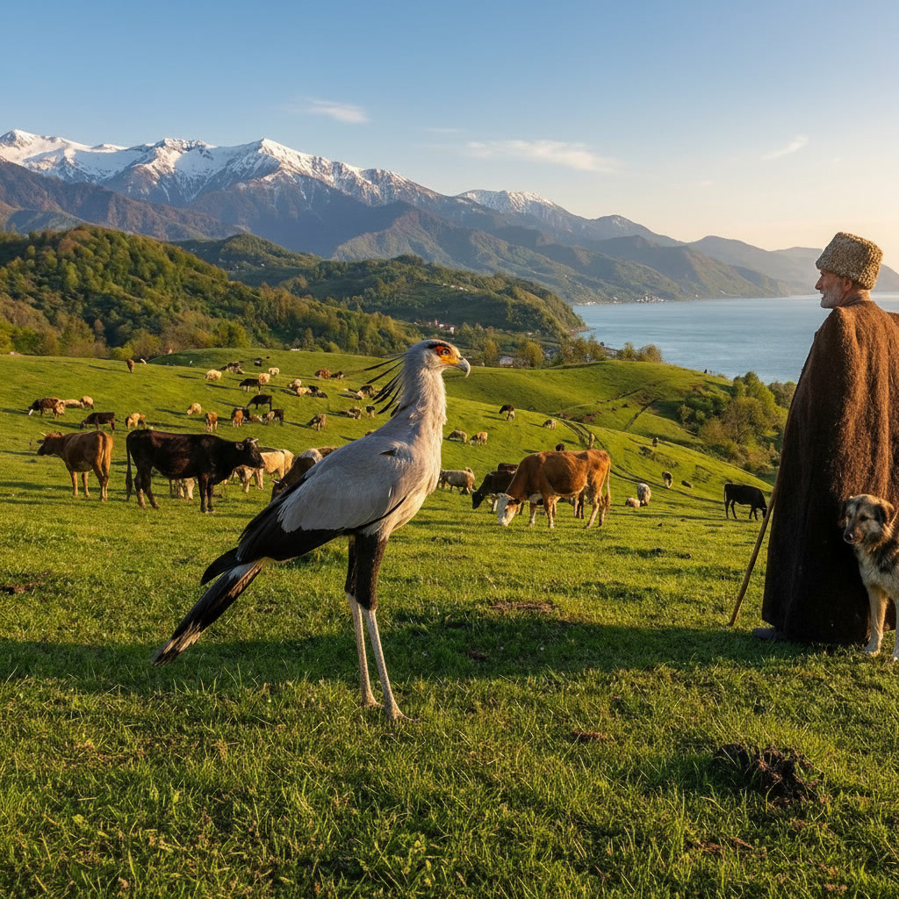

# Task 1: Using Generative AI

The image below shows the result after adding a Secretary Bird to the provided picture.

# Task 2: User Manual - Add a Secretary Bird to an Image with Leonardo AI

## Overview
This manual explains how to sign up for Leonardo AI and use its image generation tools to add a Secretary Bird to a picture.

## Prerequisites
- A computer or phone with internet access
- An email address or Google/GitHub account
- A web browser

## Step 1: Create a Leonardo AI account
1. Open your browser and go to https://app.leonardo.ai.
2. Click the Sign Up button.
3. Choose your preferred sign-up method, such as email, Google, or GitHub.
4. Complete the verification steps and log in to your account.

## Step 2: Open the image generation workspace
1. After logging in, go to the Image Generation section.
2. Select Create a new image or start a new generation project.
3. Make sure you are in the image editing/generation area before continuing.

## Step 3: Upload the reference image
1. Click the upload area in the interface.
2. Select the picture you want to edit.
3. Wait for the image to load fully before entering your prompt.

## Step 4: Enter the prompt to add the Secretary Bird
1. In the prompt box, type a clear instruction such as:
   - "Add a Secretary Bird standing naturally in the scene, matching the lighting, perspective, and style of the original picture."
2. If available, choose a style or quality setting that fits your goal.
3. Click Generate to create the edited image.

## Step 5: Review and improve the result
1. Check the generated image carefully.
2. If the bird is not placed correctly, update the prompt with more detail such as location, size, or posture.
3. Generate again until you are satisfied with the result.

## Step 6: Compare the before and after images
### Initial picture

### Final result

## Step 7: Save the final image
1. Click the download or export button.
2. Save the image to your computer.
3. Use the saved image in your assignment or report.

## Conclusion
By following these steps, you can create a professional-looking edited image with a Secretary Bird added to the original picture using Leonardo AI.
